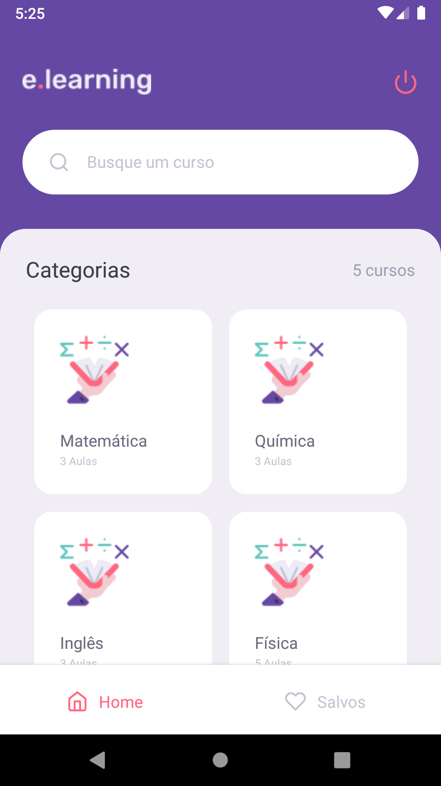
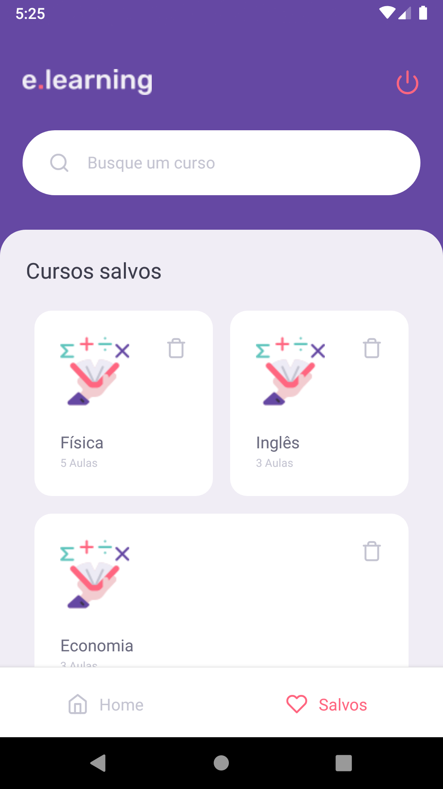
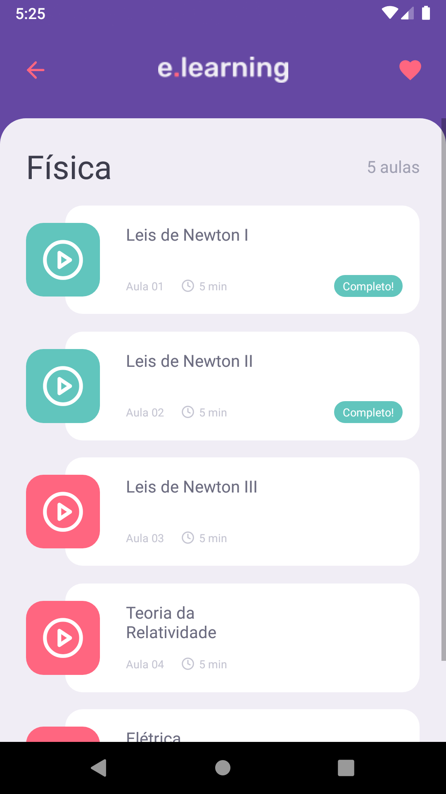
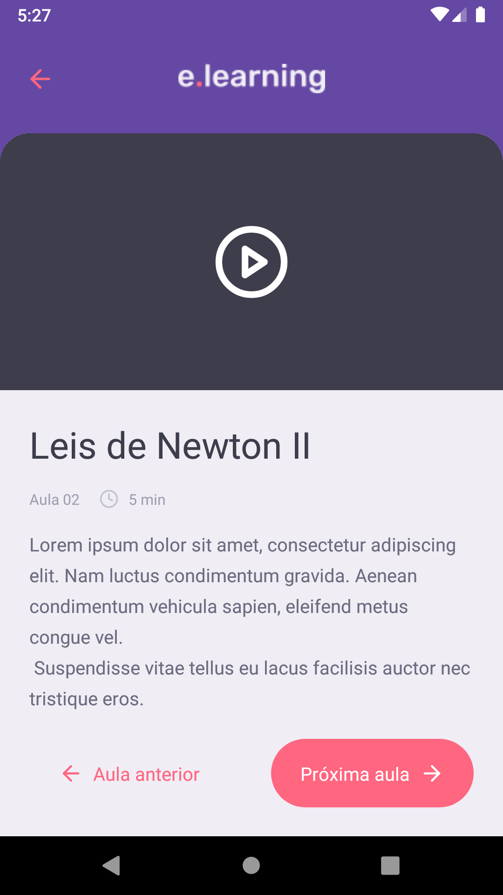

<h1 align="center">
  
</h1>

<p align="center">
  <a href="#about">About</a> •
  <a href="#preview">Preview</a> •
  <a href="#features">Features</a> •
  <a href="#techs">Technologies</a> •
  <a href="#usage">Usage</a> • 
  <a href="#license">License</a>
</p>

<h2 id="about">About</h2>
<p>
<strong>e.learning</strong> is an education platform that offers courses in video format. <br />

*<i> Project idea provided by Rocketseat as a reward for completing the GoStack Bootcamp, however only features ideas and a layout is given, but all the coding is done by me.</i><br />
</p>

<h2 id="preview">Preview</h2>

<div align="center">
  
  
  
  
</div>

<h2 id="features">Features</h2>

- Course listing
- Lessons listing
- Lesson details
- Mark course as favorite

### Plan to add

- [ ] Functional search
- [ ] Run video on lesson screen
- [ ] Splash screen

<h2 id="techs">Technologies</h2>

- TypeScript
- React Native
- Styled components
- Axios
- JSON server

<h2 id="usage">Usage</h2>

Assuming that you have a React Native environment ready:

<p><b>1.</b> Access the project folder in the command line</p>

```bash
$ cd e-learning-main
```

<p><b>2.</b> Install the app to your emulator</p> 

```bash
$ yarn android
```
If the command does not start the emulator for you, do it so and run it again.

<p><b>3.</b> Start Metro server</p>

```bash
$ yarn start
```

<p><b>4.</b> Start the JSON server</p>

```bash
$ yarn server
```

<h2 id="license">License</h2>

<p>This project is under 
<a href="https://github.com/EduardoRodriguesF/first-rocket/blob/main/LICENSE">MIT License.</a>
</p>

